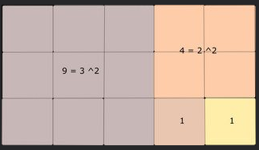

### 题目
> Rectangle into Squares

### 描述
>The drawing below gives an idea of how to cut a given "true" rectangle into squares ("true" rectangle meaning that the two dimensions are different).



Can you translate this drawing into an algorithm?  
You will be given two dimensions  
1. a positive integer length (parameter named lng)
2. a positive integer width (parameter named wdth)  

You will return an array or a string (depending on the language; Shell bash, PowerShell and Fortran return a string) with the size of each of the squares.
### Example
```
  sqInRect(5, 3) should return [3, 2, 1, 1]
  sqInRect(3, 5) should return [3, 2, 1, 1]
  or (Haskell)
  squaresInRect  5  3 `shouldBe` Just [3,2,1,1]
  squaresInRect  3  5 `shouldBe` Just [3,2,1,1]
  or (Fsharp)
  squaresInRect  5  3 should return Some [3,2,1,1]
  squaresInRect  3  5 should return Some [3,2,1,1]
  or (Swift)
  squaresInRect  5  3 should return [3,2,1,1] as optional
  squaresInRect  3  5 should return [3,2,1,1] as optional
  or (Cpp)
  sqInRect(5, 3) should return {3, 2, 1, 1}
  sqInRect(3, 5) should return {3, 2, 1, 1}
  (C)
  C returns a structure, see the "Solution" and "Examples" tabs.
  Your result and the reference test solution are compared by strings.
```

### Notes:
- - lng == wdth as a starting case would be an entirely different problem and the drawing is planned to be interpreted with lng != wdth. (See kata, Square into Squares. Protect trees! http://www.codewars.com/kata/54eb33e5bc1a25440d000891 for this problem).
  - When the initial parameters are so that lng == wdth, the solution [lng] would be the most obvious but not in the spirit of this kata so, in that case, return None/nil/null/Nothing
  - return {} with C++, Array() with Scala.
  - In that case the returned structure of C will have its sz component equal to 0.
  - Return the string "nil" with Bash, PowerShell and Fortran.
- You can see more examples in "RUN SAMPLE TESTS".

### My Solution
```javascript
function sqInRect(lng, wdth) {
    if (lng === wdth) {
        return null;
    }
    let arr = [];
    let minNum;
    let maxNum;
    arr.push(Math.min(lng, wdth));
    while (lng != wdth) {
        minNum = Math.min(lng, wdth);
        maxNum = Math.max(lng, wdth);
        lng = minNum;
        wdth = maxNum - minNum;
        arr.push(Math.min(lng, wdth));
    }
    return arr;
}
```

### Best Practices
```javascript
function sqInRect(lng, wdth){
    let arr = []
    if(lng === wdth) return null
    while(lng > 0 && wdth > 0){
        arr.push(lng > wdth ? wdth : lng)
        lng > wdth ? lng -= wdth : wdth -= lng
    }
    return arr
}
```